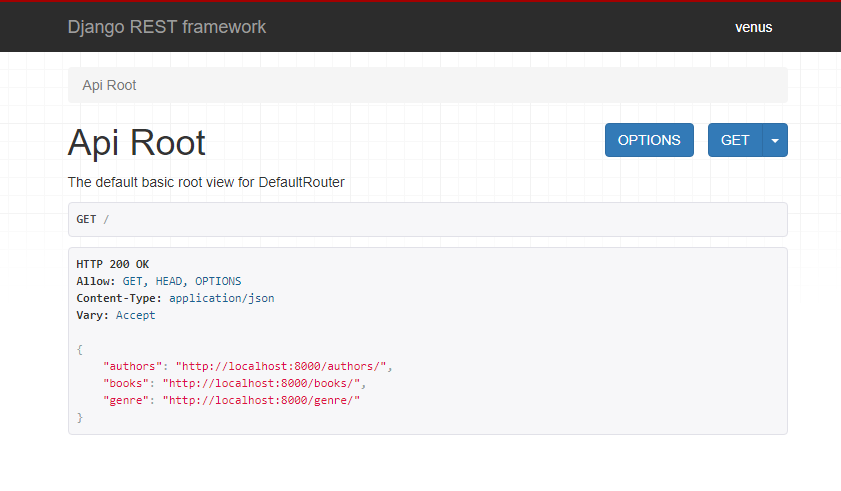
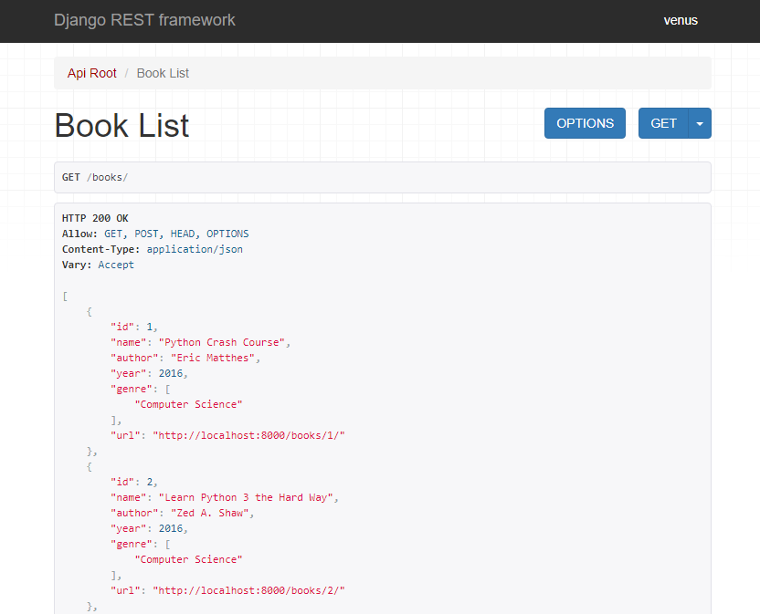
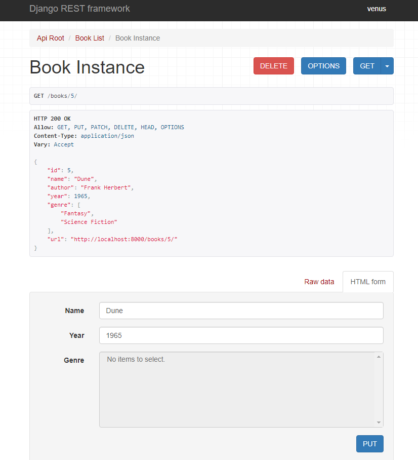

This repository contains simple REST API project.

---
WORKFLOW:

Setup:
1. **Create new project in PyCharm**
2. **Create env with conda** - conda activate -n simple_api python=3.8 -> conda activate simple_api
3. **Connect new env to PyCharm project**
4. **Install django, djangorestframework** pip install django djangorestframework
5. **Create requirements.txt** - pip freeze > requirements.txt
6. **Create .gitignore** - use [website](https://www.toptal.com/developers/gitignore), add .idea/
7. **Create README.md**

Create project:
1. **Create project** - django-admin.py startproject
2. **Add rest_framework to INSTALLED_APPS from settings.py**
3. **Run init migrations** - python manage.py migrate
4. **Run empty project** - python manage.py runserver

Create app:
1. **Create app** - python manage.py startapp books
2. **Add app books to INSTALLED_APPS from settings.py**
3. **Create urls.py in books app**
4. **Update simple_api/urls.py to include urls from books/**
5. **Create superuser for admin** - python manage.py createsuperuser
6. **Create models in books app**
7. **Create migrations and migrate** - python manage.py makemigrations -> python manage.py migrate
8. **Register models in books/admin.py**

REST API:
1. **Create books/serializer.py** - to convert data to json
2. **Create books/views.py**
3. **Register url in books/urls.py** - connected to step 4 'Create app' section
4. **Open url and check created API endpoint**

